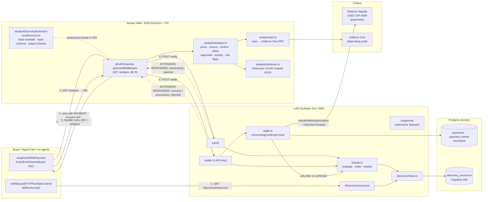
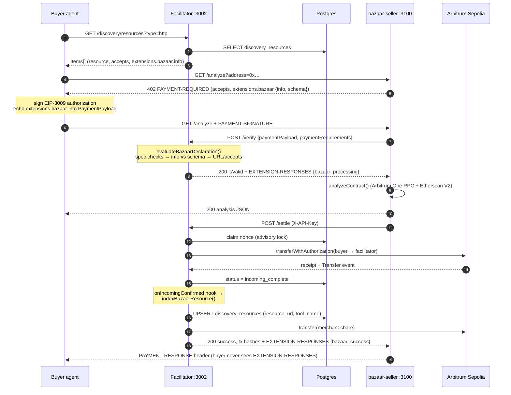

# Bazaar discovery: architecture

How the facilitator's [`bazaar` extension](https://docs.x402.org/extensions/bazaar) fits together with a
resource server that sells through it. The seller shown is
[notaxyz/bazaar-seller](https://github.com/notaxyz/bazaar-seller), an Arbitrum One contract-analysis API;
any x402 resource server that declares the extension works the same way.

## Components

- **Buyer / agent**: any x402 client. Uses `withBazaar(new HTTPFacilitatorClient(...))` from `@x402/extensions`
  to read the catalog and `wrapFetchWithPayment` from `@x402/fetch` to pay.
- **Seller**: an `@x402/express` resource server. Declares how its paid route is called with
  `declareDiscoveryExtension`; the declaration rides along in every 402 it returns.
- **Facilitator**: this repository. `/verify` and `/settle` validate the declaration echoed in the payment payload
  (`src/bazaar.ts`), the settle hook indexes it once the payer's transfer has confirmed (`src/settle.ts`),
  and `GET /discovery/resources` serves the catalog (`src/discoveryStore.ts`, migration
  `006_discovery_resources.sql`).
- **Chains**: payments settle in USDC on the network the facilitator is configured for (Arbitrum Sepolia in
  development). The data the seller sells comes from Arbitrum One and never touches the payment path.

## One discovered, paid call

1. The agent lists the catalog. Each item carries the resource URL, the price terms (`accepts`), and the seller's
   declaration (`extensions.bazaar.info`): method, example query parameters, output example.
2. The agent calls the route and receives a 402 whose `PAYMENT-REQUIRED` header repeats the declaration.
3. The client SDK signs an EIP-3009 authorization and echoes the declaration into `PaymentPayload.extensions`.
   This echo is how the declaration reaches the facilitator: the seller forwards the whole payload to `/verify`.
4. `/verify` validates the declaration (spec invariants, `info` against its own JSON Schema, absolute resource URL,
   well-formed `accepts`) and reports the outcome to the seller in the `EXTENSION-RESPONSES` header
   (`processing` or `rejected` with a reason). Payment verification is unaffected by the outcome.
5. The seller does the work and answers the buyer.
6. `/settle` submits `transferWithAuthorization`, waits for the receipt and the expected `Transfer` event, and only
   then upserts `discovery_resources`. The header reports `success`. A declaration attached to a payment that never
   lands is never indexed.

## Hardening the declaration path

Everything in `extensions.bazaar` is written by the paying client, and `/verify` is
unauthenticated. Three limits keep that from being a free lever on the facilitator:

**The JSON Schema step runs in a worker under a hard timeout** (`src/schemaGuard.ts`).
`validateDiscoveryExtension` compiles the declaration's own `schema` with Ajv and runs it
against the declaration's own `info`. Ajv turns a `pattern` into a plain `RegExp`, which
carries no linear-time guarantee and no timeout, so `{"pattern": "^(a+)+$"}` matched
against `"aaaa…b"` costs time exponential in the length of the data. Node is
single-threaded: on the main thread that is not a slow request, it is the whole process
frozen, and the rate limiter cannot answer either. The validation therefore happens on a
worker thread that can be killed, and overrunning `DISCOVERY_SCHEMA_TIMEOUT_MS` (250ms by
default) kills it. One long-lived worker serves every request, since a worker busy
backtracking cannot serve anything else anyway.

A timeout and a saturated queue both report `processing`, never `rejected`: no verdict was
reached, and a slow match can equally mean a hostile regex or a starved CPU. Claiming the
declaration is bad would condemn honest sellers whenever the box is busy, and it buys
nothing — the row is not indexed either way and the payment is untouched. Worker startup
(~100ms to spawn the thread and load the SDK) is deliberately not charged against the
validation budget, for the same reason.

**`/verify` evaluates nothing until the payment verifies.** Schema work costs real CPU and
the route takes no authentication, so an unsigned payload must not be able to spend it.
The guard above is still what bounds the cost for a caller who can produce a valid
payment; this only removes the free path.

**Resource URLs are screened** (`src/resourceUrl.ts`) against the same classes of host the
SDK already refuses for `iconUrl` — loopback, IPv4 literals, decimal- and hex-encoded
hosts — plus IPv6 literals, internal-use suffixes, bare hostnames and embedded
credentials. The resource URL is the field agents actually call, so it gets at least what
the icon gets. `DISCOVERY_ALLOW_PRIVATE_RESOURCE_URLS=true` relaxes the host rules (not
the scheme rules) for local development against a seller on localhost.

The screen runs twice: on `resource.url` before any schema work, and again on the URL that
is actually stored. The SDK derives that one as origin + the declaration's `routeTemplate`
and puts no length bound on the template, so a short `resource.url` alone says nothing
about the size of the catalogued value.

Two smaller bounds: a declaration over `DISCOVERY_MAX_DECLARATION_BYTES` (16KB) is refused
before any schema work, and `description` and `mimeType` are truncated before they are
stored, since the SDK sanitizes `serviceName`, `tags` and `iconUrl` but passes those two
through untouched. Only the `bazaar` key of the buyer's `extensions` map is republished,
not every other extension they happened to attach.

## What the catalog does and does not attest

A catalog row records that **a declaration accompanied a payment that confirmed onchain to the facilitator, settled
under the API key of the merchant stored in `merchant_address`.** That is all it records.

It does **not** attest that the declaring party controls the resource URL. The declaration and `resource.url` arrive
in the buyer's `PaymentPayload`, which the buyer signs and can edit. A buyer can settle a genuine payment to a genuine
merchant while declaring any URL and any metadata; the facilitator has no way to prove domain ownership and does not
try to. Consumers should treat entries as leads that cost someone real USDC to place, not as verified listings.

Two rules limit the damage:

- **First writer owns the key.** The merchant whose payment first indexed a `(resource, toolName)` pair owns the row.
  Later settlements by any other merchant for the same key are ignored and reported back as
  `rejected` / `resource claimed by another merchant`, so one cheap payment cannot rewrite another merchant's price,
  `payTo` or metadata.
- **`accepts` is replaced, not accumulated.** Each settlement carries the single requirement the buyer chose, and the
  newest one wins, so the row always advertises the terms the resource most recently settled on. Accumulating would
  leave superseded prices discoverable, and an agent reading a stale entry would sign an authorization the resource
  server's own 402 no longer accepts. A row therefore shows one requirement rather than every network a seller
  supports; filtering by `network`, `scheme` or `payTo` matches against it.

## Known limitations

Two gaps are known and deliberately not yet closed. Both should be fixed before a third-party seller onboards.

**A deferred declaration is lost permanently.** When the schema validator is saturated or a validation times out,
the declaration is reported `processing` and the settle carries on: the payment confirms and the nonce is consumed.
Nothing persists the pending declaration, so it is never indexed and there is no retry path. `processing` here does
not mean "will arrive later"; the seller has to settle another payment carrying the declaration for it to be
catalogued. Closing this means storing the declaration beside the payment row and teaching the recovery worker
(`src/recovery.ts`) to index it, which is a schema change plus a worker change. A small, honest declaration on an idle
facilitator does not hit this path; a third-party declaration under load can.

**The schema validator queue is shared across trust boundaries.** One worker and one 32-deep queue
(`MAX_QUEUE_DEPTH` in `src/schemaGuard.ts`) serve both unauthenticated `/verify` and authenticated `/settle`.
`/verify` does not consume the nonce, so a single validly signed payload carrying a declaration with a backtracking
`pattern` can be replayed against `/verify` to keep the queue full. Each replay costs the facilitator up to
`DISCOVERY_SCHEMA_TIMEOUT_MS` of worker time, and real settlements arriving meanwhile get `unavailable`, are
reported `processing`, and are then lost as described above. The rate limiter is the only thing bounding this today.
The remedy (separate queues per trust level, or a per-caller budget) is an open design decision.

## Files

| Concern | File |
|---|---|
| Declaration validation, indexing, `EXTENSION-RESPONSES` | `facilitator/src/bazaar.ts` |
| Worker-isolated, timed-out JSON Schema validation | `facilitator/src/schemaGuard.ts` |
| Resource URL screening (SSRF) | `facilitator/src/resourceUrl.ts` |
| Catalog table access | `facilitator/src/discoveryStore.ts` |
| Table definition | `facilitator/migrations/006_discovery_resources.sql` |
| Post-confirmation hook | `facilitator/src/settle.ts` (`SettleHooks.onIncomingConfirmed`) |
| Routes: `/supported`, `/verify`, `/settle`, `/discovery/resources` | `facilitator/src/server.ts` |
| Carrying `resource` and `extensions` through parsing | `facilitator/src/x402.ts`, `facilitator/src/types.ts` |
